# Google Search Queries Anomaly Detection using Python
 This project implements anomaly detection techniques to identify unusual patterns in search query data. By analyzing search queries, the system can detect outliers that may indicate irregular user behavior, system issues, or potential security threats. The project utilizes Python libraries for data preprocessing, feature engineering, and applying machine learning models to classify and visualize anomalies in search query logs.

## 1. Reading the data:
The dataset in total has 5 columns:  
<b>1. Top Queries:</b> These are the queries that were actually used by the web surfers.  
<b>2. Clicks: </b> These are the number of times that the user clicked on the websites of the search result.  
<b>3. Impressions:</b> These are the number of times the websites appeared on the search engine in response to the query.  
<b>4. CTR (Click Through Rate):</b> This is the ratio of click to the impression, indicating the effectiveness of the query in leading users to the website.  
<b>5. Position:</b> This is the average ranking of the website in search results for the query. 

After the data is read, there seems to be no any NULL or missing values but if we look at the data type of the columns below, CTR is shown as object, so in the future to do any kinds of operations on it, we need to convert its data type to float:  
 
<b> Original Data-type:</b> 
 
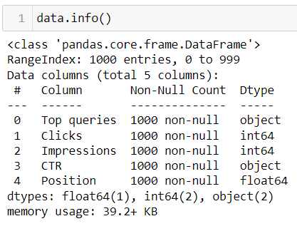
 
 
<b> Changing the data type of CTR:</b>  
 
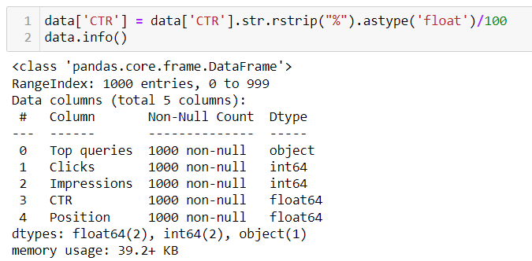
 

## 2. Top 20 words in the query:
Below are the top 20 words based on the frequency count that appeared often in the query:  
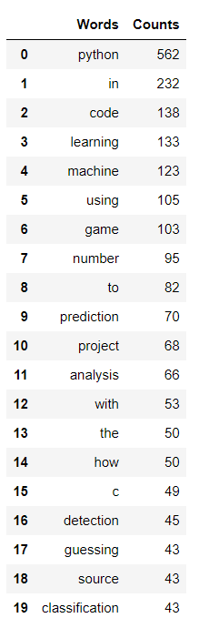

  A bar chart that represents the most frequent word in the query: <b>  
 
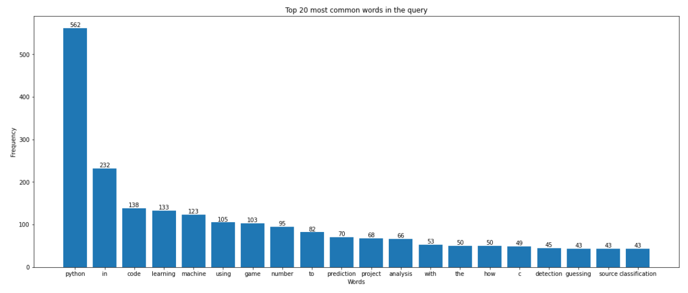

## 3. 10 Queries based on Clicks, Impressions, and CTR::
#### Top 10 Queries based on the number of clicks:
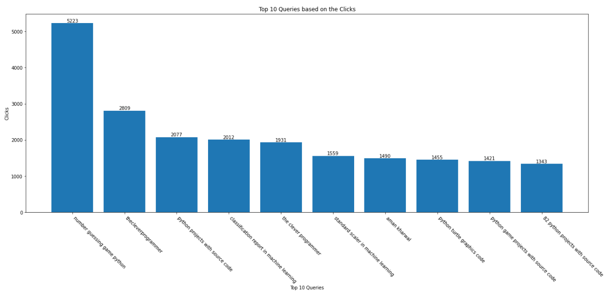

#### Top 10 Queries based on the number of Impressions:
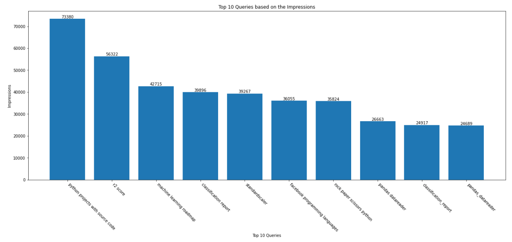

#### Top 10 queires with the highest CTR (Click Through Rate):
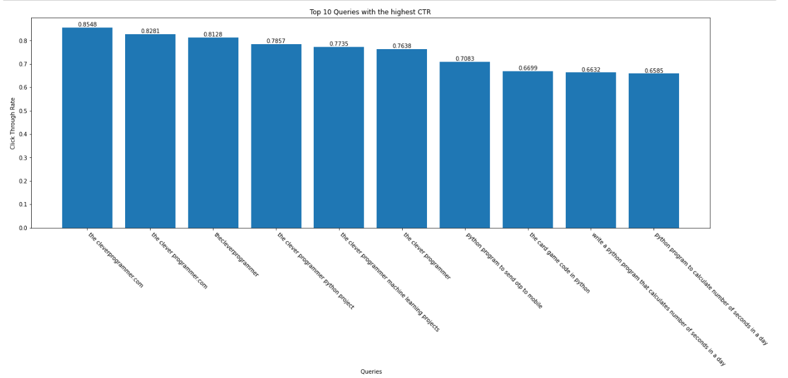

#### Bottom 10 Queries with the lowest CTR:
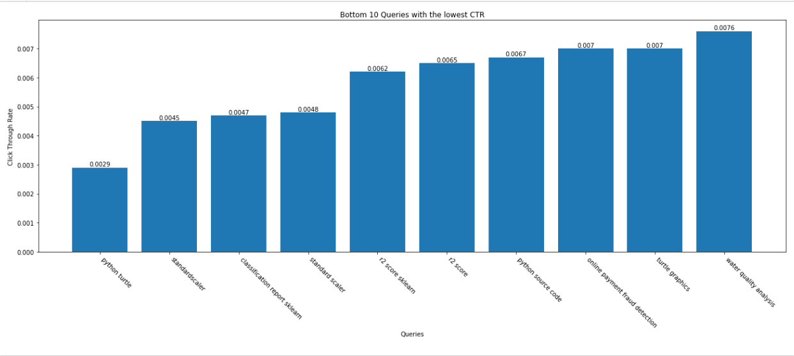

## 4. Understanding the correlation between the numerical features:
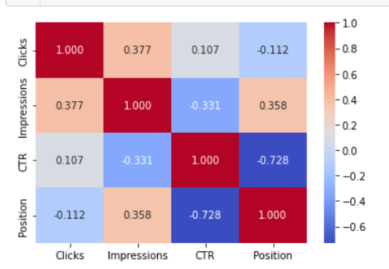

</b>

1. **Clicks and Impressions (0.377):** There is a moderate positive correlation between them. This means that as the number of impressions increases, the number of clicks also tends to increase but not that strongly.

2. **Clicks and CTR (0.107):** They have a very weak positive correlation. This means an increase in clicks is slightly associated with the higher click-through rate but the relationship is not so strong.

3. **Clicks and Positions (-0.112):** There is a slight weak correlation between them. This means if the position of the link is at a better position (lower i.e., 1 represents the first, 2 represents the second, and so on), there is a slight chance it might get clicked.

4. **Impressions and CTR (-0.331):** They have a moderate negative correlation. This means that if the link appears too often, maybe due to advertising, the click-through rate tends to decrease. This could be because the sites were more often in the search results but in less prominent positions or when the context of the search query doesn't match with the links that were shown.

5. **Impressions and Position (0.358):** There is a moderate positive correlation between them. This means as the impression of the site increases, it tends to increase their average position (where a lower number = higher ranks) slightly.

6. **CTR and Position (-0.728):** There is a strong negative correlation, and it also makes sense because a better position (lower number where 1 represents the top rank, 2 the second, and so on) will get a higher click-through

## 5. Detecting the anomalies:
For this task, we will be using Isolation Forest which is primarily used for anomaly detection.
Where, **contamination is the expected proportion of outliers.**
 
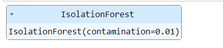

Below, 
 **False:** are the normal queries  
**True:** are the anomalies  
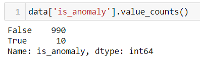

**Queries detected as anomalies:**  
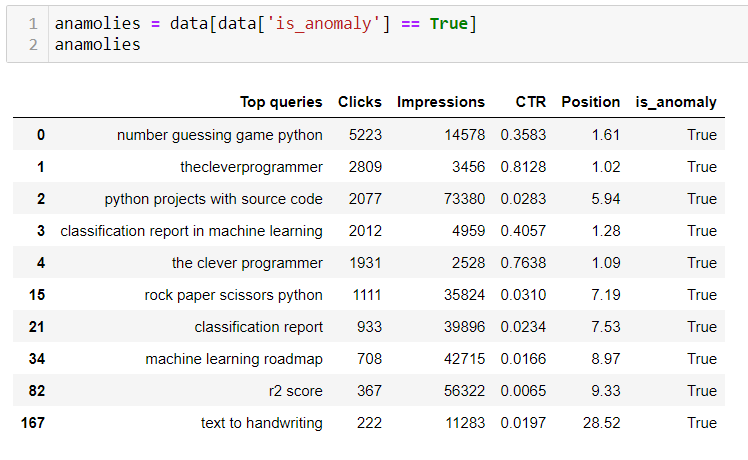

The anomalies in our search query data are more than just outliers; they highlight potential opportunities for growth, optimization, and strategic attention. These anomalies reveal emerging trends or areas of increasing interest. Being responsive to these trends is crucial for sustaining and enhancing the website's relevance and user engagement.

## 6. Summary:
Search Queries Anomaly Detection involves identifying queries that stand out as outliers based on their performance metrics. This process is valuable for businesses as it helps to uncover potential issues or opportunities, such as unusually high or low CTRs.